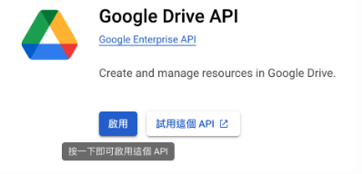
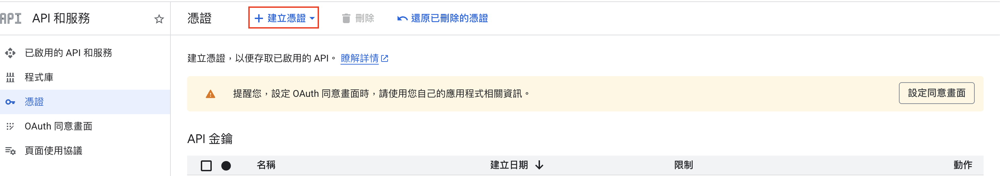
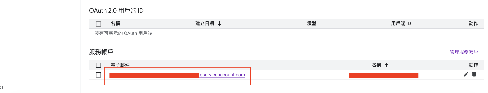
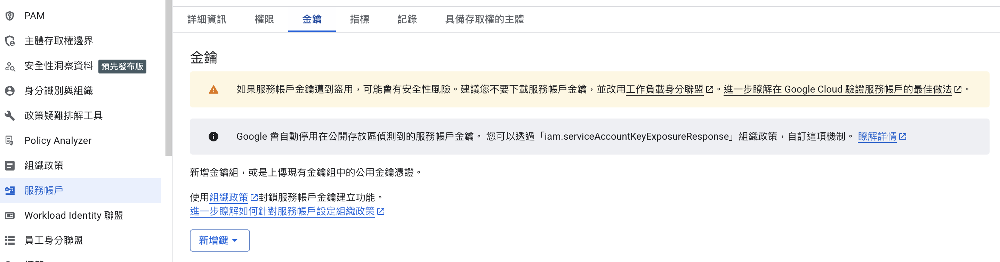
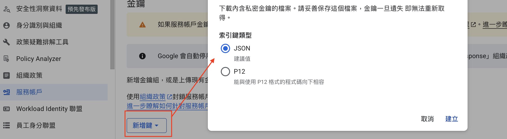
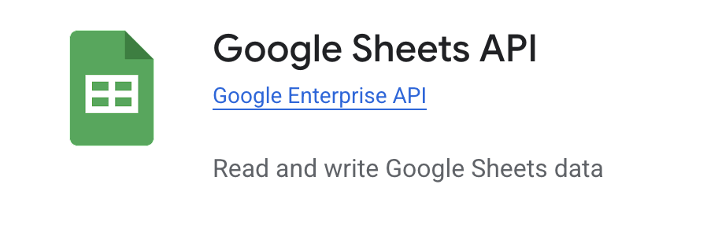

# Testcase Automation

本專案旨在透過 **Gemini CLI** 實現廣告系統（SuperDSP, OYM, ERP/OSS）測試案例的自動化產出。透過專案憲法 **GEMINI.md** 與 **Self-Evolution Workflow**，能將資深測試與 UI/UX 工程師的思維邏輯轉化為精確、可驗證且具備「自我進化」能力的測試案例。

---

## 📋 專案概覽 (Project Overview)

*   **核心目標**: 將規格文件（PDF/圖片/HTML）自動轉化為結構化的 CSV 測試案例。
*   **自我進化**: 具備「指正即學習」機制，能自動記錄錯誤教訓並在下次產出前執行「零觸發」預檢。
*   **技術基礎**: 利用 Google Gemini CLI 的模型理解能力，結合自定義的系統操作規則。
*   **自動化流程**: 產出測試案例後，自動分類儲存至本地目錄，並同步上傳至 Google Sheets。

## 📁 目錄結構 (Directory Structure)

```text
/
├── GEMINI.md                # [核心] 專案憲法：定義全域回覆、自動化學習與產出預檢流程
├── GEMINI_ERROR_LOG.md      # [進化] 歷史錯誤日誌：紀錄邏輯錯誤、格式教訓與具體案例回溯
├── GEMINI_SOP.md            # [手冊] 標準作業程序：定義具體的執行步驟與流程規範
├── README.md                # 專案說明文件與快速上手指南
├── requirements.txt         # Python 環境相依套件清單
├── package.json             # 專案配置文件，包含一鍵安裝指令 (npm run setup)
├── upload_to_sheets.py      # 自動化腳本：將產出的 CSV 上傳至 Google Sheets
├── sync_from_sheets.py      # 反向同步腳本：將雲端變更同步回本地 CSV
├── LICENSE                  # 專案授權條款
├── .env.example             # 環境變數設定範例
├── service_account/         # [資安] 存放 Google 服務帳號憑證
│   └── google_credentials.json
├── credentials_stepsImg/    # 存放憑證設定步驟的教學截圖
├── source_files/            # 原始規格文件參考 (PDF, PNG, HTML 等)
│   ├── Superdsp phase 1.0~1.7.0/
│   ├── Superdsp CCT/Custom Audience/
│   ├── SuperDSP Pilot for AOE (Phase 1 & 2)/
│   ├── HTML/                # 系統介面 HTML 檔
│   ├── user_manual/         # 各系統操作手冊
│   └── test/                # 測試用規格文件
├── generated_test_cases/    # 產出的測試案例儲存區 (依來源專案分類)
│   └── [專案名稱]/           # 包含產出的 CSV 與 UserStory 分析檔
└── .gemini/                 # Gemini CLI 配置資料夾
    ├── commands/            # 自定義 Speckit 系列指令
    └── skills/              # 核心專家技能 (test-case-automation-expert)
```

---

## 🚀 快速上手 (Quick Start)

### 0. 複製專案 (Clone Project)
首先，將此專案複製到您的本地電腦：
```bash
git clone https://github.com/wangdanson/testcase_automation.git
cd testcase_automation
```

### 1. 安裝環境 (Environment Setup)

在開始使用前，請確保您的開發環境已安裝基礎組件 (Node.js 與 Python)，然後執行一鍵安裝指令。

#### A. 系統基礎環境 (System Prerequisites)
*   **Node.js**: 建議版本 v18.0.0 以上 ([下載連結](https://nodejs.org/))。
*   **Python**: 建議版本 v3.9 以上 ([下載連結](https://www.python.org/))。

#### B. 一鍵安裝所有套件 (Quick Setup)
在專案根目錄執行以下指令，系統將自動安裝 **Gemini CLI** (Node.js 套件) 與 **Python 相依套件**：
```bash
npm run setup
```
*(此指令會執行：`npm install -g @google/gemini-cli` 以及 `pip install -r requirements.txt`)*

### 2. 安全性設置 (Security Setup)
本專案採用機密資訊分離原則，請依照以下步驟配置：

#### A. 獲取 Google 服務帳號金鑰 (JSON)
根據 Google Drive API 標準設定流程，請執行以下步驟：

1.  **建立新專案**: 登入 [Google Cloud Console](https://console.cloud.google.com/)，點選「選取專案」並選擇「新增專案」，為專案命名後點擊「建立」。
2.  **啟用 Google Drive API**: 在左側選單點擊「API 和服務」>「啟用 API 和服務」。搜尋「**Google Drive API**」並將其啟用。
    
3.  **前往憑證頁面**: 在左側選單選擇「API 和服務」>「憑證」。
    
4.  **授予服務帳號權限**: 到 google sheet 表單中，並將產出的電子郵件帳號加入共用名單，並設定為「編輯者」。
    
5.  **產生並下載 JSON 金鑰**: 
    *   在服務帳戶列表中點擊該帳戶的 Email。
    *   切換至「**金鑰 (Keys)**」頁籤。
        
    *   點擊「新增金鑰」>「建立新的金鑰」> 選擇「**JSON**」並建立。
        
    *   系統會自動下載 JSON 檔案，請將其重新命名為 `google_credentials.json` 並放入 `service_account/` 資料夾。
6.  **啟用 Google Sheets API**: 在左側選單點擊「API 和服務」>「啟用 API 和服務」。搜尋「**Google Sheets API**」並將其啟用。
    

#### B. 共享試算表權限 (關鍵步驟)
1.  **複製服務帳戶 Email**: 格式如 `account-name@project-id.iam.gserviceaccount.com`。
2.  **授予編輯權限**: 開啟目標 Google 試算表，點擊「**共用**」，將該 Email 加入並設為「**編輯者**」。

#### C. 設定環境變數
1.  將 `.env.example` 複製為 `.env`。
2.  填入您的 `SPREADSHEET_ID`（網址中 `/d/` 後方的一串字元）。
3.  **確認資安**: `.env` 與 `service_account/` 已被加入 `.gitignore`，機密資訊不會被上傳。


### 3. 自動化產生測試案例 (Automation Workflow)

啟動 Gemini CLI 並下達指令：
```bash
gemini
```

**範例指令：**
> 「幫我產生 [來源資料夾名稱] 的 test case」

**Gemini 將自動執行以下流程：**
1.  **分析**：讀取 `source_files/[來源資料夾名稱]` 下的規格文件與 `GEMINI_ERROR_LOG.md`。
2.  **建立目錄**：在 `generated_test_cases/` 下建立一個與來源同名的子目錄。
3.  **產出與備份**：生成帶有時間戳記的 CSV 檔案，並將其儲存至該子目錄中。
4.  **同步上傳**：自動呼叫 `upload_to_sheets.py` 將該 CSV 檔案同步上傳至 Google Sheets，並在試算表中建立同名的工作表。

### 🔄 4. 反向同步 (Reverse Sync)

若您在 **Google Sheets** 上直接修改了測試案例內容，並希望將這些變更更新回本地端的 CSV 檔案，可以使用反向同步功能。

**與 Gemini CLI 對話的快速指令：**
您可以直接在對話框中對我下達以下指令，我會自動為您執行同步腳本：

1.  **指定專案名稱**：
    > 「Sync [專案名稱]」
    > *(例如：`Sync Phase 2`，我會自動去 `generated_test_cases` 下找對應的最新檔案執行。)*

2.  **直接貼上檔案路徑或檔名**：
    > 「同步這個檔案：[檔名].csv」

3.  **針對剛產出的檔案**：
    > 「同步剛剛產出的 test case」

---

**手動執行腳本指令：**
若需手動執行，請在終端機輸入：
```bash
python3 sync_from_sheets.py "generated_test_cases/[專案路徑]/[檔名].csv"
```

**功能特色：**
*   **自動匹配**：腳本會根據 CSV 檔名自動尋找 Google Sheets 中同名的工作表。
*   **完整覆蓋**：從雲端抓取最新資料並覆蓋本地 CSV。
*   **格式保證**：維持 `utf-8-sig` 編碼與 CSV 引用規範，確保 Excel 開啟不亂碼。

---

## 🛡️ 自動記錄錯誤 (Automatic Error Recording)

本專案導入了自動化學習機制，確保系統在任何環境下都能持續優化：

1.  **指正即學習 (Self-Learning)**:
    當使用者指出產出內容的錯誤（格式、邏輯或排版）時，Gemini 將**自動分析**根因並將教訓增補至 `GEMINI_ERROR_LOG.md`。此流程無需手動要求。
2.  **產出前預檢 (Pre-output Validation)**:
    在執行任何 CSV 產出或上傳前，Gemini 必須**強制讀取** `GEMINI_ERROR_LOG.md`，並逐一核對本次內容是否觸發過往錯誤。
3.  **零觸發標準**:
    只有在確認完全符合歷史規範（如：全包裹引號、實體換行、正確權限邏輯）後，產出才被視為有效。

---

## ⚙️ 產出規範 (Production Standards)

為確保 CSV 在 Google Sheets 與 Excel 中的相容性與排版美觀，必須遵守以下強制規範：

| 規則項目 | 說明 | 強制性 |
| :--- | :--- | :---: |
| **全欄位包裹** | 所有欄位（標頭與內容）必須使用 **雙引號 (")** 包裹 | **Critical** |
| **實體換行** | `操作步驟` 與 `期望結果` 使用 **實際換行 (Actual Line Break)**，禁止 `\n` | **Critical** |
| **內容純淨** | 嚴禁在內容中加入「資深測試工程師：」等角色自述文字 | **Mandatory** |
| **標籤排序** | 測試功能標籤順序：【權限】>【功能新增】>【正向】>【反向】>【整合】... | **Mandatory** |
| **無句號結尾** | 測試情境、操作步驟、期望結果之結尾不加句號 `。` | **Mandatory** |

---

## 🛠 維護與貢獻
*   **專案憲法**: `GEMINI.md` 定義了跨帳號、跨電腦的一致性行為規範，請勿隨意修改其核心邏輯。
*   **錯誤日誌**: 若發現邏輯漏洞，請直接在對話中「指正」Gemini，系統會自動更新 `GEMINI_ERROR_LOG.md`。

---
*Created and maintained by wangdanson.*
